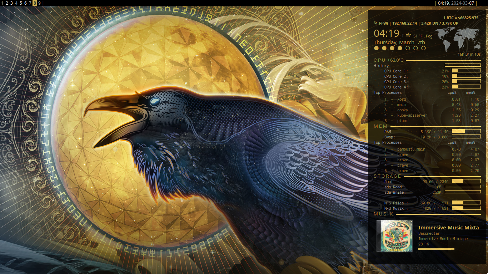
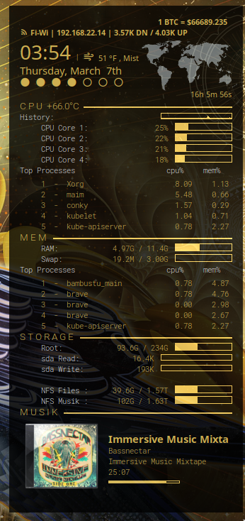

# the-raven-conky-theme
a custom conky theme by nixsalad with added customizations by deftclaw  
see original theme: [https://github.com/nixsalad/the-raven-conky-theme](https://github.com/nixsalad/the-raven-conky-theme)  

My first *published* conky theme

Some things it displays: (from top to bottom)
- bitcoin current price (coinbase api, no key required)
- wifi ssid, ipv4 address, and network speed
- current time, date, and outside temperature (openweatherapi - inspired by closebox73)
- CPU temperature, usage, and list the cpu-heavy processes
- memory usage and list the memory-heavy processes
- storage usage and disk i/o speeds
- music "now playing" with mpd (last.fm api - inspired by https://github.com/floriandejonckheere/conky-mpd)
- transparency with picom 

# Install
Clone the theme to $XDG_CONFIG_HOME/conky/the-raven-conky-theme:  
  - `[ -d $XDG_CONFIG_HOME/conky ] || mkdir -pv $XDG_CONFIG_HOME/conky`  
  - `git clone https://github.com/briskconfig/the-raven-conky $XDG_CONFIG_HOME/conky/the-raven-conky-theme`  
Set the number of CPU cores to watch:  
  - `cd $XDG_CONFIG_HOME/conky/the-raven-conky-theme`  
  - `scripts/set_cpus.sh`  
Launch conky, look for any problems in /tmp/conky.log  
  - `conky -c $XDG_CONFIG_HOME/conky/the-raven-conky-theme/the-raven.conf &>>/tmp/conky.log &`

